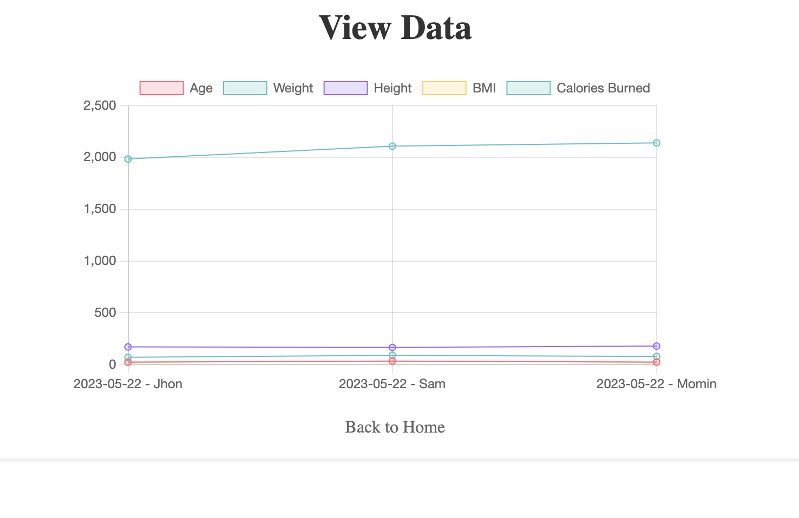

# Fitness Management System

This repository contains the source code and documentation for the Fitness Management System desktop application. The application allows users to track and manage their fitness data. It includes several key functionalities as described below:

## Functionalities

### Home Page (index.html)
The home page serves as the entry point to the application. While the specific details of this page have not been provided, it is expected to offer navigation to other pages such as Add, Edit, Delete, Settings, and View Data.

### Add Functionality (add.html)
The Add page provides a form for users to input new fitness data. The form fields align with the data structure in the existing JSON file, including age, weight, height, BMI, and calories burned. Upon form submission, a JavaScript function would create a new entry in the JSON file and update the chart on the View Data page accordingly.

### Edit Functionality (edit.html)
The Edit page allows users to modify existing fitness data. It typically displays the current data for a specific entry and provides a form pre-populated with the existing data. Upon form submission, the corresponding entry in the JSON file is updated with the new data.

### Delete Functionality (delete.html)
The Delete page enables users to remove an existing entry from the dataset. It may include a dropdown or another mechanism to select the entry for deletion. A JavaScript function removes the selected entry from the JSON file and updates the chart on the View Data page.

### View Data Page (view.html)
The View Data page fetches fitness data from a JSON file and presents it graphically using Chart.js. The data visualization includes age, weight, height, BMI (Body Mass Index), and calories burned. The visualization takes the form of a line chart, which is ideal for tracking changes over time. The page also applies the selected theme from the Settings page.

### Settings Page (settings.html)
The Settings page allows users to customize their viewing experience by selecting a theme. Two themes are available: Light and Dark. When a theme is selected and submitted, it is stored in the browser's local storage and applied to the application's interface.

## Testing Section

The Fitness Management System is implemented as a desktop application using HTML, CSS, JavaScript, and Electron.js. It is designed to be cross-platform and should work correctly on any modern desktop operating system. The application relies on standard desktop technologies and does not include any OS-specific code. It is advisable to conduct rigorous testing across different operating systems (Windows, macOS) to ensure compatibility and consistent behavior.

## Conclusion and Future Work

The Fitness Management System provides a simple and user-friendly way to track and visualize fitness data. It utilizes modern desktop technologies, ensuring compatibility across a range of devices and operating systems. The ability to switch between light and dark themes enhances the user experience.

However, there is room for improvement and future work, including:

- User Authentication: Implement a login system to allow multiple users to track their fitness data separately.
- Data Input: Provide a feature for users to input or update their fitness data dynamically.
- Expanded Metrics: Include additional metrics such as heart rate, steps taken, distance covered, etc.
- Data Export/Import: Allow users to export their data for use in other applications or import data from other fitness apps.
- Notifications/Reminders: Implement a feature to remind users to log their data or notify them of achieved fitness goals.

By implementing these enhancements, the Fitness Management System could become a comprehensive tool for individual fitness tracking and progress monitoring.

## Screenshots

